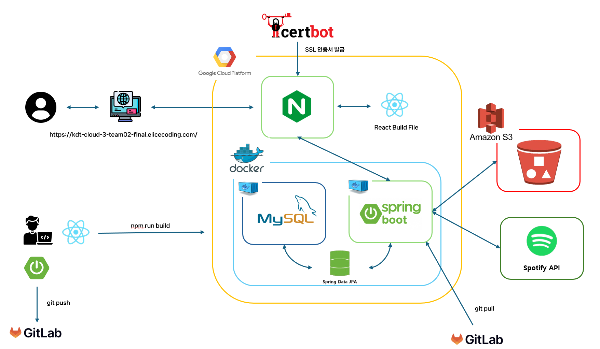
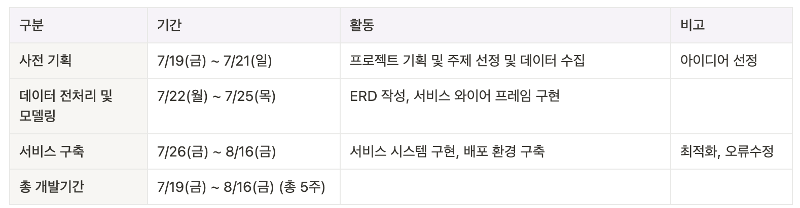
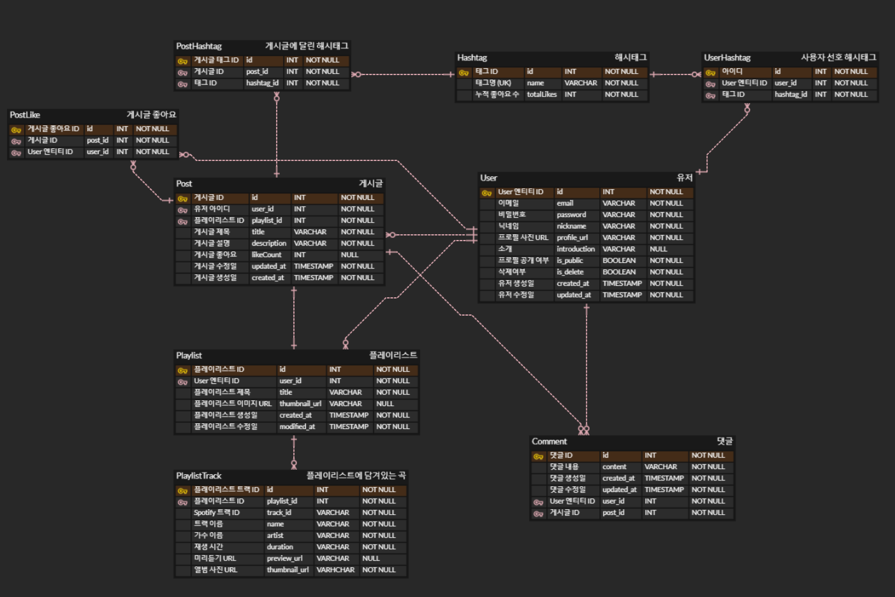
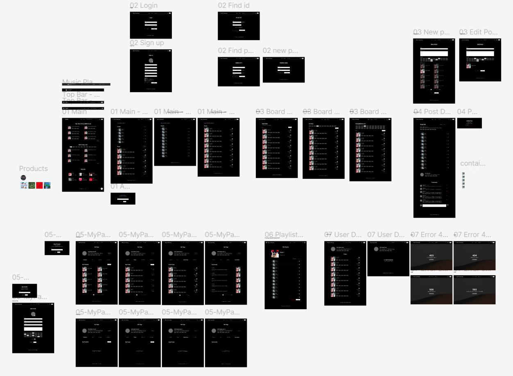

# 🎧 chillvibe

### 주제 선정 배경

---
음악을 스트리밍하거나 다운로드하는 데 집중하는 웹사이트는 많지만 커뮤니티와 상호작용할 수 있는 플랫폼은 부족하다는 생각이 들어
이러한 배경을 바탕으로 사용자가 자신의 음악적 취향을 다양하게 표현하고, 커뮤니티와 소통할 수 있는 플랫폼을 개발하는 것이 목표로 진행했다.

### 프로젝트 구조

---

### 기술 스택

---

#### ✔︎ 백엔드

1. SpringBoot
2. Spring Data JPA
3. Spring Security
4. MySQL
5. Spotify API

#### ✔︎ 프론트엔드

1. React
2. MUI
3. Zustand
4. Axios
5. React Router
6. JavaScript

#### ✔︎ 배포

1. GCP
2. Docker
3. Nginx

  

  

  

### 개발 기간

---

### ERD

---

### 와이어프레임

---

#### 🔗 <https://www.figma.com/design/xDXj2JncIlU8C4ePFsdcUF/elice-final-pj.?t=FsLwT5vFGMplhdX8-0>

### 기능 소개

---

#### ✔︎ 유저

- 유저 프로필 AWS S3 업로드
- 로그인 시 Access 토큰과 Refresh 토큰 발급
- Access 토큰 만료 시 Refresh 토큰을 이용해 토큰 재발급 후 API 재요청
- 비로그인 상태에서도 다른 유저들의 게시글과 유저 정보 열람 가능
- 해당 유저가 게시글 공개여부를 비공개로 설정하면 사용자들이 게시글 열람 불가
- 회원정보 수정 및 회원 탈퇴 가능

#### ✔︎ 메인

- 좋아요 순으로 플레이리스트 게시글 조회
- 인기태그별 게시글 조회
- 인기 플레이리스트에서 랜덤으로 트랙 추천

#### ✔︎ 플레이리스트

- 플레이리스트 생성하고 트랙 추가 삭제 시 썸네일이 생성되고 S3에 업로드 후 링크 가져옴
- 플레이리스트 이름 수 제한 100자
- 원하는 가수, 트랙 제목을 검색하여 플레이리스트에 추가 가능
- 플레이리스트 상세 페이지에서 다중 선택 삭제 가능
- 트랙 수가 4개 이상일시 1~4번의 트랙 이미지 가져와 2x2 썸네일 생성 ( 3개 이하일때 첫 번째 트랙의 이미지 가져옴 )
  

#### ✔︎ 해시태그

- 유저 프로필에 선호하는 장르 해시태그 설정
- 게시글에 해당 플레이리스트에 어울리는 해시태그 설정
- 태그별 게시판/인기태그별 게시판에서 해시태그를 통한 필터링
- 유저 프로필/게시글에 소속된 해시태그 클릭 시 태그별 게시판으로 이동, 필터링 된 게시글 조회

#### ✔︎ 게시글

- 게시글 작성 및 수정 간 필수입력 부분 누락시 스낵바 표시
- 게시글 장문 작성 및 줄바꿈 기능
- 게시글 생성 시 버튼 로딩기능 구현으로 무한 생성 방지
- 게시글 삭제 시 연관된 좋아요 카운트 감소
- 게시글 상세페이지 내에서 작성자만 수정, 삭제버튼 활성화

#### ✔︎ 댓글

- 비로그인 상태에서 댓글 작성 불가능
- 댓글 생성, 수정할 때 0자이거나 255자를 초과할 경우, 댓글 작성 버튼 비활성화
- 자신이 작성한 댓글만 수정, 삭제 가능 ( 댓글 작성자와 현재 로그인한 사용자 일치할 경우에만 수정 및 삭제 버튼 활성화 )
- 댓글이 수정될 경우 "(수정됨)"이라는 문자와 함께 수정된 시간으로 변경됨
   